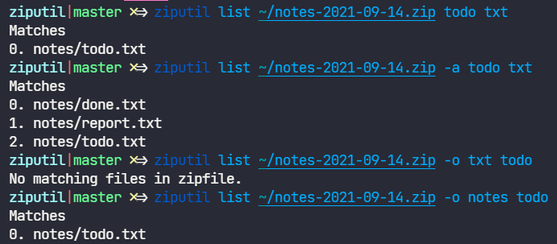

# ziputil

This is a little utility to help you get files out of a `zip` without having to extract every file.

Currently, there are three commands:

- `list` -- print list of files in the zip
- `choose` -- list files in the zip and extract a choice
- `view` -- list files in the zip and then `cat` (basically only useful for plaintext, where _plaintext notes backups_ was my primary usecase)

And flags...

- `-o` or `--ordered` -- force queries to be matched in left to right order
- `-a` or `--any` -- show file that matches ANY query word, rather than ALL

